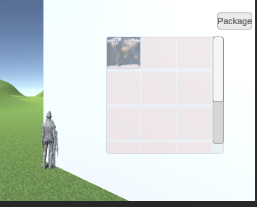

# 3D游戏编程与设计课程最后一次作业
## 前言
本次作业参考学长学姐的作业，使用UI系统完成了一个简易的任务面板和一个简易的背包。任务面板可隐藏，可展开折叠，并且在玩家完成了任务后可以自动变更。背包也可以折叠，并且实现了“收纳”物品。
## 一、前置准备
为了完成本次作业，在正式开始UI面板的制作前，我们首先准备好了地形和玩家。玩家照旧使用的是Ethan。地形则是随机布置的。


此外，我们准备了两项简单的任务，均为让玩家获取某样东西。这样，整体就构成了一个粗糙的小游戏。
## 二、内容介绍
本次制作的公告板是一个可伸缩的任务板，通过点击，可以展开或隐藏其文字信息，通过点击特定按钮可以实现对整个公告板的隐藏。公告板上内容为玩家需要完成的任务，当玩家完成了任务后，公告板信息会发生变动，显示任务完成。

本次制作的公告板为一个简易的十二格背包，开始时背包是空的，在玩家完成任务获取物品后，物品会被放入背包（本次其实只使用前两格）。


## 三、代码展示
### 1. 公告板伸缩实现代码
首先，是公告板实现伸缩的代码，本部分代码参考借鉴了一些资料，通过使用携程成功实现了面板的伸缩。首先，使用UI下的Scroll View组件。为其子物体Viewport的子物体Content添加组件Vertical Layout Group 和 Content Size Fitter。并按照图片修改Scroll View 和 Content配置。


完成配置之后还可以删除Scroll View 的子物体 Scrollbar Horizontal，公告板并不会用到它。

在游戏开始时，公告板是收起的状态，每一条信息由一个Button和一个Text组成，通过为Button添加点击事件来修改文字是折叠的还是展开的这一状态。本次，我们一共制作了三条信息，结构如下图：


具体代码如下：
```
public class ButtonAction : MonoBehaviour
{
    public Text expandText;
    private int frame = 30;  
    private float height = 180;
    void Start()
    {
        Button button = this.gameObject.GetComponent<Button>();
        button.onClick.AddListener(OnClick);
		// 开始时文本收起
        StartCoroutine(FoldText());
    }

    IEnumerator FoldText() {
		// 获取文本底部坐标
        float textY = height;
		// 按帧收起文本
        for (int i = 0; i < frame; ++i) {
            textY -= height / frame;
            expandText.rectTransform.SetInsetAndSizeFromParentEdge(RectTransform.Edge.Right, 0, expandText.rectTransform.sizeDelta.x);
            expandText.rectTransform.SetInsetAndSizeFromParentEdge(RectTransform.Edge.Bottom, 0, textY);
            if (i == frame - 1) {
                expandText.gameObject.SetActive(false);
            }
            yield return null;
        }
    }

     IEnumerator UnfoldText() {
		// 获取文本底部坐标
        float textY = 0;
		// 按帧展开文本
        for (int i = 0; i < frame; ++i) {
            textY += height / frame;
            expandText.rectTransform.SetInsetAndSizeFromParentEdge(RectTransform.Edge.Right, 0, expandText.rectTransform.sizeDelta.x);
            expandText.rectTransform.SetInsetAndSizeFromParentEdge(RectTransform.Edge.Bottom, 0, textY);
            if (i == 0) {
                expandText.gameObject.SetActive(true);
            }
            yield return null;
        }
    }

	// 点击事件
    void OnClick() {
		// 如果文本在展开状态
        if (expandText.gameObject.activeSelf) {
			// 使用协程收起
            StartCoroutine(FoldText());
        }
        else {
			// 使用协程展开
            StartCoroutine(UnfoldText());
        }
    }
}
```
本部分代码需要为三个按钮依次添加，其中的变量expandText应被设置为Button对应的Text（例如：本次Button1对应的就是test1）

到这里，我们基本上就完成了一个简易的公告板。之后，为了更漂亮，可以为公告板添加背景和标题等。
### 2. 公告板隐藏实现代码
之后，为了隐藏整个公告板，为UI添加一个新的按钮，若公告板为已显现状态，点击该按钮可以隐藏公告板。否则，点击该按钮可以展现公告板。该操作的实现也是通过为按钮添加点击事件实现的。

OnClick部分具体代码如下：
```
if (tm.transform.gameObject.GetComponent<TMP_Text>().text=="-") {
            obj.SetActive(false);//隐藏公告板
            tm.transform.gameObject.GetComponent<TMP_Text>().text="+";//修改按钮字符
        }
        else {
            obj.SetActive(true);  //显示公告板
            tm.transform.gameObject.GetComponent<TMP_Text>().text="-";//修改按钮字符
            
        }
```
完整代码详见Github。

其中obj应被置为需要隐藏的面板，而tm应被设置为按钮对应的Text。这里需要注意的是，因为Button对应的文本的类型不是Text，而是TMP，所以需要有“using TMPro;”，并且使用代码中方法修改文本内容。

实现效果如下：


### 3. 简易背包的代码
最后，为了让作业更加完整，尝试实现了一个简易的背包。本次游戏中，玩家通过碰撞收纳物品。碰撞后，物体隐藏而背包中按照顺序将有一个空格子被占用。其具体表现效果为有一个格子的图片变为物品的贴图。

仍旧使用Scroll View组件来实现背包。本次的配置仍然删除Scroll View 的子物体 Scrollbar Horizontal并取消对其的使用。其他配置不需要更改。之后，为Scroll View 的子物体Viewport的子物体Content添加12个Image子物体。这十二个Image初始Sprite都为None，且大小一致，整齐排列。并且，为了方便后续使用，修改其名字为"box"+i(例如：box3)。

到这里，我们已经有了一个空背包，但这个背包，还无法收纳物品和隐藏。

为其添加隐藏和显现的按钮，具体代码与之前公告板的隐藏按钮类似，这里不再另外展示，详见Github。

而背包收纳部分的代码则加到了物体的碰撞函数中，也是在该部分实现的任务状态的更改。其中的sname为物品贴图的名字。这些贴图都被存放在Resources中，知道名字即可。而对Image的修改不能使用Texture2D类型，而需要Sprite类型。我们可以通过如下代码修改：
```
texture1 = Resources.Load<Texture2D>(sname);
sprite1 = Sprite.Create(texture1, new Rect(0, 0, texture1.width, texture1.height), new Vector2(0.5f, 0.5f));
```
而碰撞触发的函数具体代码如下：
```
void OnCollisionEnter(Collision co){
        if(co.gameObject.tag=="Player"){
            //更改任务状态
            btn.transform.gameObject.GetComponent<TMP_Text>().text="Task Completed";
            txt.text="You have completed this task.Thank you for your help.";
            int k=1;
            string num="box"+k;
            while(image==null){//查找可以存放的格子，直到找到
                foreach (GameObject go in Resources.FindObjectsOfTypeAll(typeof(GameObject)) as GameObject[]){
                    if(go.name==num){//判断是不是格子
                        if(go.GetComponent<Image>().sprite==null) {//判断格子是否为空
                            image=go.GetComponent<Image>();
                            break;
                        }
                        else {
                            k++;
                            num="box"+k;
                        }
                    } 
                }
            }
            
            image.sprite=sprite1;//修改贴图
            this.transform.gameObject.SetActive(false);//隐藏物体
        }
    }
```
其中，因为在拾取物品时背包不一定是打开的，非打开状态时背包的SetAction是false，所以查找格子要能够查找隐藏的。为此，必须使用Resources.FindObjectsOfTypeAll()进行查找。



到这里，我们也成功实现了背包的存储。玩家可以根据公告板的任务提示完成任务，获取物品存入背包。

## 四、成果展示

视频地址：https://live.csdn.net/v/268647

Github地址：https://github.com/LiliNancy/3dgame-homework-last

## 五、参考内容

#### 老师上课用课件
#### CSDN博客：https://blog.csdn.net/StuGeek/article/details/122154638
#### CSDN博客：https://blog.csdn.net/x2_yt/article/details/71330103
#### CSDN博客：https://blog.csdn.net/shaobing32/article/details/122977889